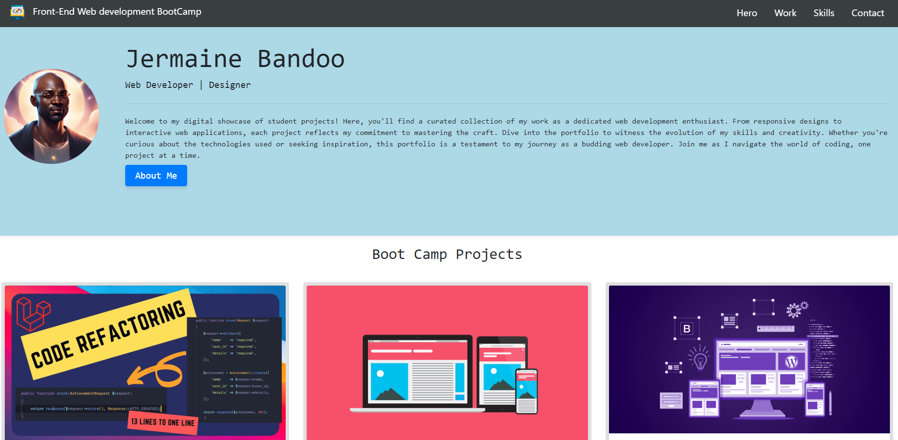

# Project Overview

In this project, I created a portfolio layout using the Bootstrap CSS Framework, showcasing my skills, projects, and an "About Me" section.

## Table of Contents

- [Project Overview](#project-overview)
- [Features](#Features)
- [Installation](#installation)
- [contributing](#contibuting)
- [Usage](#usage)
- [License](#License)
- [credits](#credits)
- [Contact](#Contact)

## Features

- Responsive navigation bar with links to different sections.
- Hero section with a jumbotron featuring a personal picture and brief description.
- Work section displaying projects using Bootstrap cards.
- Skills section listing skills expected to be learned from the bootcamp.
- About/Contact section providing more information about the developer.
- Footer with hyperlinks and hover effects.

## Installation

Options

1. Download repository file in a zip file and open in VS Code
  
2. Clone the repository to your local machine.
   ```bash
   git clone https://github.com/jjbstudent/BootStrap-Portfolio.git

## Contributing

Helpful resources used for this project

- [Bootstrap Documentation](https://getbootstrap.com/docs/5.3/getting-started/introduction/)

- [Responsive Web Design - How to Create Media Queries](https://www.youtube.com/watch?v=5xzaGSYd7jM)

- [Media Queries 101 by CSS Tricks](https://css-tricks.com/css-media-queries/)

- [Media Query Documentation](https://www.w3schools.com/css/css_rwd_mediaqueries.asp)

- [Github Pages Guide](https://pages.github.com/)


## Usage
Student profile which contains all projects upto date.
The card section contains all the projects displaying an a grid struture format

Preview of website


## License
MIT licence

## Credits
1. TA support
2. Online Tutors
3. Slack huddle - Francis

## Contact
jblearn2023@gmail.com
